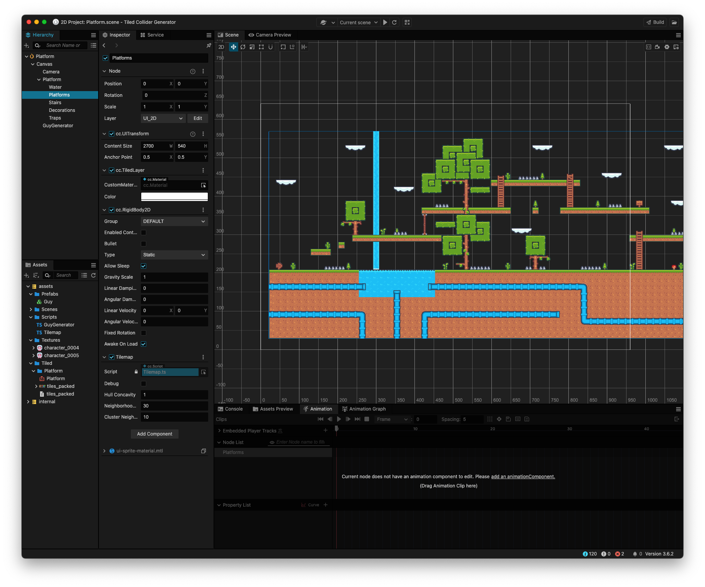
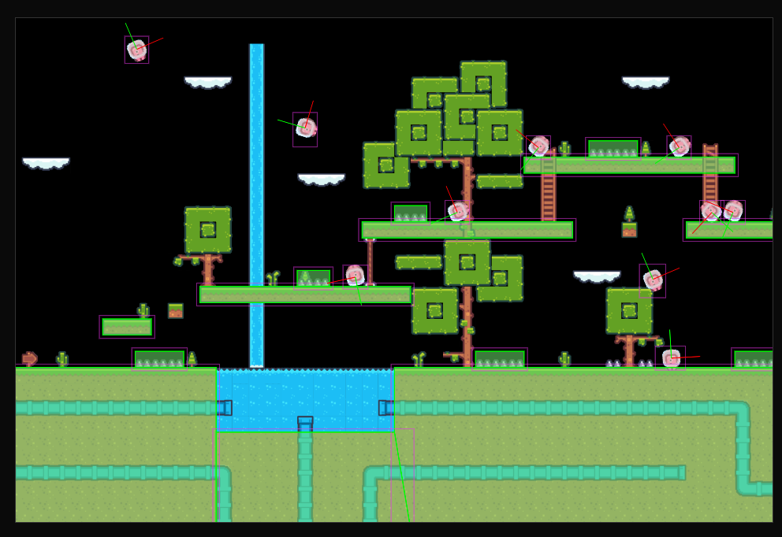

# Cocos Creator Tiled Collider Generator

Demo here: https://tabanella.me/cocos-engine-5-ways-to-move/

Blog here: https://blog.tabanella.me/articles/cocos-creator/five-ways-to-move-in-cocos-creator/

1. Install the dependencies in package.json

2. In cocos creator add the script to the Tiled sub-node where you want to generate the colliders. RigidBody is added automatically, usually you want is to be static.

3. Set parameters if needed

